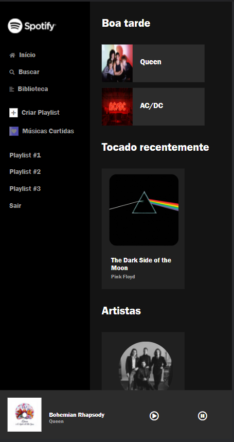

<h1 align="center">Spotify Clone</h1>

<h5 align= "center">( https://pedro-arruda.github.io/spotify-clone/ )</h5>

<h2 align="center"> 
	Concluído 🟢
</h2>

<h2> 
	Demonstração do projeto
</h2>

	
	
	

## Tecnologias:
  

    
    
    
  

## 👦 Autor

Feito por Pedro Arruda 👋 [Entre em contato!](https://www.linkedin.com/in/pedro-scucuglia-arruda/)
